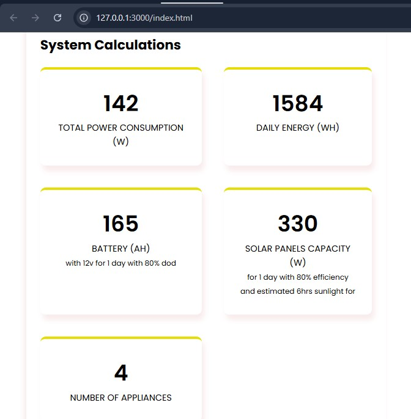

## 🔋 Load Calculator for Solar & Power Needs

A simple, responsive web application built using **HTML**, **CSS**, and **vanilla JavaScript** to estimate daily power consumption and energy needs. Perfect for planning **solar systems**, **inverter backups**, or optimizing electricity usage in **homes** and **offices**.

Live Demo: [load-calc.onrender.com](https://load-calc.onrender.com)

---

### ✨ Features

- ✅ **Add custom appliances** with power ratings and usage time
- ✅ **Instant calculation** of:

  - Total Power Load (W)
  - Daily Energy Consumption (Wh)
  - Battery Backup Requirements (AH)
  - Solar Panel Capacity (W)

- ✅ **Backup Days & Voltage Options**
- ✅ **Responsive UI** built with modern CSS (Poppins font)
- ✅ **Downloadable Report** using `html2pdf.js` 📄

---

### 📸 Screenshot



---

### 🛠️ Tech Stack

- **HTML5** – Semantic structure
- **CSS3** – Responsive design with utility classes
- **JavaScript (ES6)** – Dynamic DOM manipulation and calculations
- **[html2pdf.js](https://github.com/eKoopmans/html2pdf)** – Export calculations to PDF

---

### 🚀 Getting Started

To run the project locally:

```bash
git clone https://github.com/Popthemy/js-playground.git
cd load-calculator
open index.html
```

Or simply **deploy to a static host** like GitHub Pages, Vercel, or Render.

---

### 📂 Project Structure

```
/css
  └── styles.css
/js
  └── main.js
index.html
README.md
```

---

### 📄 License

MIT License — Feel free to use, modify, and share!
